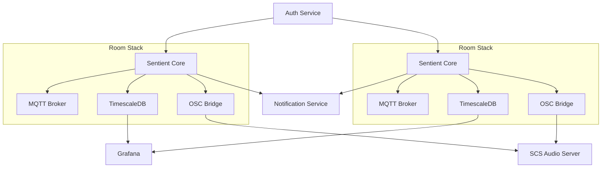
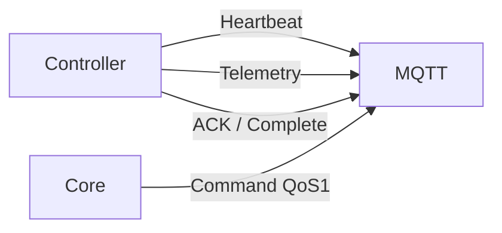
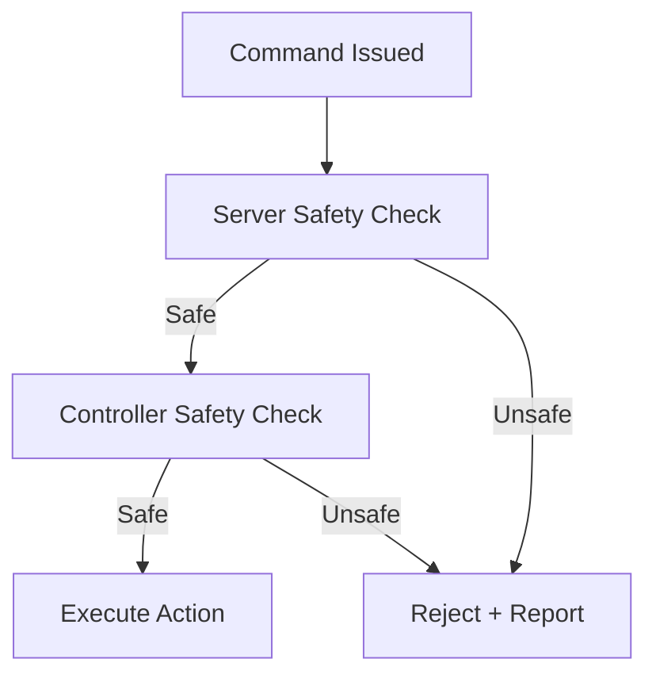

# Sentient Neural Engine

## Real-Time Theatrical Escape Room Orchestration Platform

### Architecture Specification — Version 8

---

## 0. Purpose & Design Intent

Sentient Neural Engine (SNE) is a **server-authoritative, real-time theatrical control system** designed to operate **high-end, highly technical escape rooms** as synchronized performances.

Primary goals:

- Sub-50ms end-to-end command latency
- Deterministic cue timing
- Parallel scene and puzzle execution
- Strong safety guarantees (dual-layer)
- Operational resilience and fault isolation
- Offsite awareness for Technical and Creative Directors

This document is the **canonical build reference** and incorporates *all architectural decisions agreed upon through design discussion*.

---

## 1. Deployment Environment

### 1.1 Hardware

- Server: Dell R710
- CPU: Dual processors
- RAM: 256 GB
- NICs: 4 physical NIC ports
- Audio: External 16-channel sound card (used by external SCS server)

### 1.2 Operating System

- Ubuntu Server 24.04 LTS (headless)
- SSH access only

---

## 2. High-Level System Topology

### 2.1 Multi-Room Model

- Up to 4 rooms run concurrently
- Each room is a **fully isolated stack**
- Restarting a room must not affect others

### 2.2 Per-Room Stack (Docker Compose Project)

Each room runs its own Docker Compose project:

- sentient-core (real-time scheduler)
- mqtt-broker (MQTT v5)
- timescaledb (state + telemetry)
- osc-bridge (Sentient → SCS)

### 2.3 Shared Services

- sentient-auth (RBAC)
- sentient-notify (push notifications)
- Reverse proxy (Traefik / NGINX)
- Grafana

---

## 3. Network & Isolation Model

### 3.1 VLAN Strategy (UDM Pro)

- One VLAN per room
- Controllers may only access their room stack
- No lateral room-to-room traffic

### 3.2 Docker Networking

- One Docker network per room
- Shared services on admin network

---

## 4. Controller Layer

### 4.1 Supported Controllers

- Teensy 4.1 (Ethernet)
- ESP32
- Raspberry Pi

### 4.2 Firmware Contract (Strict)

All controllers must implement:

- MQTT v5
- Heartbeats + LWT
- Safety state reporting
- Idempotent command execution
- Command ACK + completion
- Watchdog timeout behavior
- Device-defined safe idle
- Signed firmware
- Authenticated commands (HMAC/signatures)
- Normalized sensor states

---

## 5. Communication Model

### 5.1 MQTT

- Protocol: MQTT v5
- QoS: 1 for commands
- Addressing: topic-per-device
- Broker: dedicated per room (Docker)

### 5.2 OSC (Audio)

- Sentient → SCS
- Transport: UDP
- Reliability: application-level ACKs + retries

---

## 6. Real-Time Core Scheduler

### 6.1 Execution Model

- Server-authoritative
- Controllers are intentionally dumb
- 1 ms internal scheduler resolution
- Hybrid architecture: RT core + async services

### 6.2 Language

- Rust (Tokio)

### 6.3 Time Model

- Monotonic server time
- Per-device sequence numbers
- NTP everywhere (server authoritative)

---

## 7. Graph-Based Creative System

### 7.1 Representation

- Directed graphs
- Nodes = cues / logic
- Edges = conditions / events
- Parallel graphs supported

### 7.2 Preconditions

- Explicit boolean expressions
- Temporal clauses (debounce, duration)
- Continuously evaluated
- Wait indefinitely until met or overridden

### 7.3 Versioning

- Version-pinned execution
- No hot-swap during live runs

---

## 8. Gamemaster Interaction Model

### 8.1 Overrides

- Priority injection
- Graph-scoped
- Fully audited

### 8.2 Fault Recovery

- FAULT pauses graph paths
- Gamemaster explicitly resumes

---

## 9. Safety Architecture (Dual-Layer)

### 9.1 Dual Safety Model

1. Server-side safety gating
2. Controller-side enforcement

### 9.2 Safety Classification

- Binary: safety-critical vs non-critical

### 9.3 Canonical Safety States

- SAFE
- BLOCKED
- FAULT
- E\_STOP
- MAINTENANCE
- reason\_code
- latched

### 9.4 Latching & Reset

- Reset only via Technical UI
- Technical Administrator only
- Dual confirmation required

---

## 10. Failure & Fault Handling

### 10.1 Controller Watchdog

- Missed heartbeat → safe idle

### 10.2 Safe Idle

- Device-defined safe state

### 10.3 Command Timeout

- No completion → FAULT
- Graph paths paused

---

## 11. Persistence & Data

### 11.1 Database

- TimescaleDB (Postgres)

### 11.2 Logging

- Full telemetry
- Adaptive downshift under load

### 11.3 Retention

- Raw telemetry: 30–90 days
- Aggregates retained longer

---

## 12. Observability

### 12.1 Metrics

- Scheduler jitter
- MQTT RTT
- Command backlog
- Heartbeats
- Safety state

### 12.2 Dashboards

- Mandatory room runtime dashboards

---

## 13. Backup & Recovery

- Automated scheduled backups
- Off-server storage
- Periodic restore testing in staging

### 13.1 Warm Standby (Manual Promotion)

- Per room, maintain a warm standby stack capable of taking over if the primary room stack fails
- Promotion is manual and operator-driven (no automatic failover), with safety-first validation before re-arming devices
- Standby is kept current via configuration/version synchronization and regularly exercised during restore testing

---

## 14. Security

### 14.1 Authentication

- Central RBAC
- Users created only in Technical UI

### 14.2 Secrets

- Encrypted secrets store
- Runtime injection

### 14.3 Device Identity

- Auto-discovery announce
- Manual approval
- Per-device keys
- Identity rebinding supported

---

## 15. OTA Strategy

- ESP32: native OTA
- Raspberry Pi: package/A-B updates
- Teensy: supervised Ethernet update or manual fallback

---

## 16. Audio Architecture

- External SCS server
- Sentient sends OSC cues
- No in-core audio playback

---

## 17. Version 8 — Notifications & Mobile Push

### 17.1 Goals

- Offsite director notifications
- No login required
- iOS + Android support

### 17.2 Architecture

- sentient-notify service
- Outbound internet from R710
- Firebase Cloud Messaging (FCM)

### 17.3 Clients

- Sentient Companion mobile app
- Deep links into web UIs

### 17.4 Alert Sources

- Runtime benchmark breaches
- Safety FAULT / E\_STOP
- Controller offline
- OSC failures
- Gamemaster login
- Room power events
- Backup failures

### 17.5 Alert Model

- INFO / WARN / CRITICAL
- Escalation until acknowledged
- Full audit trail

---

## 18. Explicitly Deferred

- UI visual polish
- In-core audio playback (continue using external SCS via OSC)
- Predictive analytics / ML

---

## 19. Architectural Status

Sentient Neural Engine v8 is architecturally complete. This document is the single source of truth for implementation.

---

## Appendix A — System Diagrams (Mermaid)

### A.1 Overall System Topology



### A.2 Controller Communication Flow



---

## Appendix B — Firmware Contract Specification

### B.1 Required MQTT Topics (Example)

- `room/{room_id}/device/{device_id}/cmd`
- `room/{room_id}/device/{device_id}/ack`
- `room/{room_id}/device/{device_id}/state`
- `room/{room_id}/device/{device_id}/telemetry`
- `room/{room_id}/device/{device_id}/heartbeat`

### B.2 Command Payload (Required Fields)

```json
{
  "command_id": "uuid",
  "sequence": 12345,
  "issued_at": "timestamp",
  "action": "OPEN|CLOSE|MOVE|SET",
  "parameters": {},
  "safety_class": "CRITICAL|NON_CRITICAL"
}
```

### B.3 ACK / Completion Payload

```json
{
  "command_id": "uuid",
  "status": "ACCEPTED|REJECTED|COMPLETED",
  "reason_code": "OPTIONAL",
  "safety_state": "SAFE|BLOCKED|FAULT|E_STOP"
}
```

### B.4 Heartbeat Payload

```json
{
  "uptime_ms": 12345678,
  "firmware_version": "x.y.z",
  "safety_state": "SAFE",
  "last_error": null
}
```

---

## Appendix C — Safety Flow



---

## Appendix D — Operational Runbooks

### D.1 Room Bring-Up

1. Power controllers
2. Verify VLAN connectivity
3. Start room Docker Compose
4. Confirm heartbeats in dashboard
5. Arm room (no execution)
6. Start game

### D.2 Live Incident (FAULT)

1. Alert received (push + UI)
2. Graph auto-paused
3. Inspect device state
4. Resolve physical issue
5. Gamemaster resumes graph

### D.3 Safety Reset (Latched)

1. Physical condition verified safe
2. Technical Admin logs into Technical UI
3. Dual confirmation performed
4. Reset issued
5. Device returns SAFE

### D.4 Backup Restore Test

1. Restore backup into staging stack
2. Validate schema + checksums
3. Start core in dry-run mode
4. Verify dashboards and alerts

---

## Appendix E — Alert Severity Mapping (Version 8)

| Event                  | Severity |
| ---------------------- | -------- |
| Room Power On          | INFO     |
| Gamemaster Login       | INFO     |
| Scheduler Jitter High  | WARN     |
| Controller Offline     | CRITICAL |
| Safety FAULT / E\_STOP | CRITICAL |
| OSC Cue Failure        | CRITICAL |
| Backup Failure         | WARN     |

---

## Appendix F — AI Agent Development Handoff Pack (Required)

This appendix defines **everything an AI development agent needs** to implement Sentient Neural Engine v8 without requiring additional architectural decisions.

### F.1 Deliverables (What must be built)

**Per Room (x4 room stacks):**

1. `sentient-core` (Rust) — real-time scheduler + graph runner + safety gate + MQTT/OSC integration
2. `mqtt-broker` (MQTT v5)
3. `timescaledb` (Postgres + Timescale)
4. `osc-bridge` — Sentient → SCS OSC transport with ACK/retry

**Shared (one instance):** 5. `sentient-auth` — centralized auth + RBAC + user provisioning API (Tech UI is the only place users are created) 6. `sentient-notify` — push notifications (FCM) + escalation + audit log 7. Reverse proxy — routes `tech.*`, `creative.*`, `mythra.*` to correct UI/API backends 8. Grafana — dashboards backed by TimescaleDB

**UIs:** 9. `tech-ui` — configuration, device provisioning, user management (admin only), safety reset authority 10. `creative-ui` — graph editor (directed graph), publish/versioning 11. `mythra-ui` — gamemaster dashboard, overrides (priority injection), monitoring

**Mobile:** 12. `sentient-companion` mobile app (iOS/Android) — receives push notifications; deep links into web apps

---

### F.2 Non-Functional Requirements (Hard Constraints)

- **Latency:** Target sub-50ms end-to-end command latency.
- **Scheduler resolution:** 1ms internal scheduler resolution.
- **Transport:** MQTT v5 for controller commands/events; QoS 1 for commands.
- **Addressing:** Topic-per-device.
- **Safety:** Dual gating (server pre-check + controller enforcement). Controller remains final authority.
- **Fault isolation:** Full stack per room; restarting one room must not affect others.
- **Logging:** Adaptive (full telemetry by default; downshift when performance threatened).
- **Directors offsite:** Push notifications must work even when directors are not logged in.

---

### F.3 Repository Layout (Recommended)

A multi-repo or mono-repo is acceptable. If mono-repo:

```
/sentient
  /services
    /sentient-core
    /sentient-auth
    /sentient-notify
    /osc-bridge
  /apps
    /tech-ui
    /creative-ui
    /mythra-ui
    /sentient-companion
  /infra
    /docker
      /room-stack-template
      /shared-stack
    /schemas
    /docs
```

---

### F.4 Service Contracts (APIs)

#### F.4.1 UI ↔ Backend Protocol

- REST for configuration/control
- WebSockets for realtime updates

#### F.4.2 Auth Service (`sentient-auth`)

**Responsibilities:**

- User CRUD (Tech UI only)
- RBAC roles/permissions
- Token issuance (JWT)

**Required roles (minimum):**

- `TECH_ADMIN`
- `TECH_DIRECTOR`
- `CREATIVE_DIRECTOR`
- `GAMEMASTER`

**REST Endpoints (minimum):**

- `POST /auth/login`
- `POST /auth/refresh`
- `GET /auth/me`
- `POST /users` (TECH\_ADMIN only; Tech UI only)
- `PATCH /users/{id}`
- `GET /users`
- `GET /roles`

#### F.4.3 Room API (exposed by `sentient-core` or a room-api sidecar)

**REST (minimum):**

- `POST /room/{room_id}/arm`
- `POST /room/{room_id}/disarm`
- `POST /room/{room_id}/start`
- `POST /room/{room_id}/stop`
- `POST /room/{room_id}/checkpoint/{checkpoint_id}/jump`
- `POST /room/{room_id}/graph/{graph_id}/publish`
- `POST /room/{room_id}/override` (Mythra only)

**WebSocket (minimum channels):**

- `room.state`
- `graph.state`
- `device.state`
- `alerts`

---

### F.5 Data Model (Timescale/Postgres)

Minimum tables (expand as needed):

**Core runtime:**

- `rooms(room_id, name, status, armed, active_run_id, updated_at)`
- `runs(run_id, room_id, graph_version_id, started_at, ended_at, result)`
- `graphs(graph_id, name, created_at)`
- `graph_versions(graph_version_id, graph_id, version, published_by, published_at, definition_json)`
- `devices(device_id, room_id, name, controller_type, safety_class, status, last_seen)`
- `device_state(device_id, state_json, updated_at)`

**Events/telemetry (Timescale hypertables):**

- `events(time, room_id, type, correlation_id, payload_json)`
- `telemetry(time, room_id, device_id, metric, value, payload_json)`
- `command_log(time, room_id, device_id, command_id, sequence, action, status, latency_ms, correlation_id)`

**Audit:**

- `audit_log(time, user_id, role, room_id, action, payload_json)`

**Notifications:**

- `alerts(alert_id, time, room_id, severity, type, correlation_id, payload_json, ack_by, ack_at, resolved_at)`
- `alert_deliveries(alert_id, channel, target, status, error, sent_at)`
- `user_device_tokens(user_id, platform, token, last_seen, enabled)`

---

### F.6 MQTT Topic Namespace & Payloads (Normative)

**Topic naming (normative):**

- `room/{room_id}/device/{device_id}/cmd`
- `room/{room_id}/device/{device_id}/ack`
- `room/{room_id}/device/{device_id}/state`
- `room/{room_id}/device/{device_id}/telemetry`
- `room/{room_id}/device/{device_id}/heartbeat`

**Command payload (normative):**

```json
{
  "command_id": "uuid",
  "sequence": 12345,
  "issued_at": "RFC3339 timestamp",
  "action": "OPEN|CLOSE|MOVE|SET",
  "parameters": {},
  "safety_class": "CRITICAL|NON_CRITICAL",
  "correlation_id": "uuid"
}
```

**ACK/completion payload (normative):**

```json
{
  "command_id": "uuid",
  "status": "ACCEPTED|REJECTED|COMPLETED",
  "reason_code": "OPTIONAL",
  "safety_state": "SAFE|BLOCKED|FAULT|E_STOP|MAINTENANCE",
  "correlation_id": "uuid"
}
```

**Heartbeat payload (normative):**

```json
{
  "uptime_ms": 12345678,
  "firmware_version": "x.y.z",
  "safety_state": "SAFE|BLOCKED|FAULT|E_STOP|MAINTENANCE",
  "last_error": null
}
```

**Idempotency rule (normative):**

- Controllers must maintain a bounded cache of recent `command_id`s and must not re-actuate a duplicate command.

---

### F.7 OSC Bridge Contract (Normative)

- Transport: UDP OSC
- Reliability: application-level ACK + retry

**Requirements:**

- Every OSC cue includes `cue_id` and `correlation_id`.
- Bridge retries until ACK or timeout.
- Failure triggers CRITICAL alert (`OSC_CUE_FAILURE`).

---

### F.8 Graph Engine Definition (Normative)

**Graph type:** Directed graph.

**Node types (minimum):**

- `CUE` (issues one or more device commands)
- `WAIT_CONDITION` (preconditions)
- `BRANCH` (conditional routing)
- `CHECKPOINT` (safe restore point)
- `GROUP` (parallel node group)

**Preconditions rules (normative):**

- Preconditions are explicit boolean expressions with temporal clauses.
- Evaluation is continuous.
- If conditions are not met, node waits indefinitely until met or Gamemaster override occurs.

**Versioning rules (normative):**

- Runs are pinned to a `graph_version_id`.
- Publishing creates a new version.

---

### F.9 Safety Rules (Normative)

**Dual gating (normative):**

- Server checks safeties prior to publish.
- Controller rechecks safeties on receipt and may reject.

**Safety state schema (normative):**

- `SAFE`, `BLOCKED`, `FAULT`, `E_STOP`, `MAINTENANCE`
- `reason_code`
- `latched` boolean

**Latched reset authority (normative):**

- Only TECH\_ADMIN via Technical UI can initiate a reset.
- Dual confirmation required: admin approval + controller reports safe.

**Failure behavior (normative):**

- Missing heartbeats → controller enters device-defined safe idle.

---

### F.10 Alerts & Notifications (Normative)

**Push provider:** Firebase Cloud Messaging (FCM)

- R710 has outbound internet and sends push directly.

**Alert severity:** INFO / WARN / CRITICAL

**Minimum alerts (normative):**

- `ROOM_POWER_ON` (INFO)
- `GAMEMASTER_LOGIN` (INFO)
- `SCHEDULER_JITTER_HIGH` (WARN)
- `CONTROLLER_OFFLINE` (CRITICAL)
- `SAFETY_FAULT` / `E_STOP` (CRITICAL)
- `OSC_CUE_FAILURE` (CRITICAL)
- `BACKUP_FAILURE` (WARN)

**Director requirement:** push must be delivered regardless of director login state.

---

### F.11 Performance Benchmarks (Initial Targets)

These thresholds are used for alerting and adaptive logging.

- Scheduler tick overrun (WARN): >2ms overrun in a 1s window
- Scheduler tick overrun (CRITICAL): sustained >5ms overrun
- MQTT command end-to-end latency (WARN): p95 > 30ms
- MQTT command end-to-end latency (CRITICAL): p95 > 50ms
- Command backlog depth (WARN): > 100 queued commands
- Command backlog depth (CRITICAL): > 500 queued commands

(Thresholds can be tuned; initial values provide a starting point.)

---

### F.12 Docker Compose Templates (Required)

**Room stack template (minimum services):**

- `sentient-core`
- `mqtt-broker`
- `timescaledb`
- `osc-bridge`

**Shared stack template (minimum services):**

- `sentient-auth`
- `sentient-notify`
- `reverse-proxy`
- `grafana`

Each room stack must be independently restartable.

---

### F.13 Testing Requirements

**Automated tests (minimum):**

- Unit tests for graph evaluation and scheduler
- Integration tests with MQTT broker
- Integration tests for ACK/complete flows
- OSC bridge retry/timeout tests

**Load/soak tests (required):**

- Synthetic MQTT traffic at worst-case cue rates
- Parallel graph execution
- Worst-case failure injection: packet loss, broker restart, controller offline

**Dry-run mode (required):**

- Mock device layer with full timing/logging, no hardware commands

---

### F.14 Acceptance Criteria (Definition of Done)

A build is acceptable when:

1. A room can run a full directed graph with parallel paths and deterministic ordering.
2. Commands are delivered via MQTT v5 QoS1 with ACK+completion.
3. Safety gating prevents unsafe commands server-side and controller-side.
4. Faults pause only affected graph paths; recovery requires Gamemaster resume.
5. Latched safety reset can only be executed by TECH\_ADMIN in Technical UI with dual confirmation.
6. Logs and telemetry are written to TimescaleDB with adaptive downshift under load.
7. Grafana dashboards show runtime room health.
8. Notifications deliver push via FCM to iOS and Android reliably when directors are offsite and not logged in.
9. Each room stack can be restarted independently without impact to other rooms.
10. Automated load tests pass without violating CRITICAL performance thresholds.

---

## Appendix G — Implementation Order (Recommended)

1. Define schemas (graph JSON, MQTT payloads, DB schema)
2. Build sentient-core skeleton (scheduler + MQTT + DB)
3. Implement safety engine (server gating + state machine)
4. Implement graph runner (nodes, conditions, parallelism)
5. Implement ACK/completion + idempotency logic
6. Add OSC bridge
7. Implement auth + RBAC
8. Implement notify + FCM
9. Build UIs (Tech → Creative → Mythra)
10. Build mobile companion app
11. Load/soak testing + tuning

---

**End of Document — Sentient Neural Engine v8**
